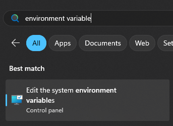
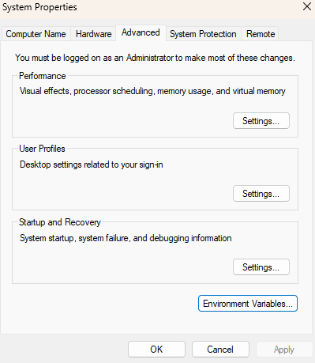
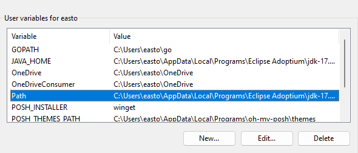
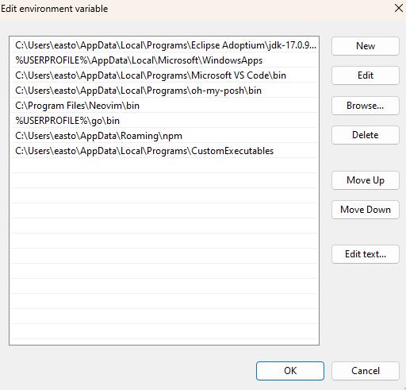

# Secure File Storage

This is a simple program that allows the user to easily encrypt and decrypt raw data of a file.

This program uses the sha256 hashing algorithm.

## Usage

sfs --encrypt /path/to/file  
sfs --decrypt /path/to/file  
sfs --help 

## Installation

1. Download sfs.exe
2. Add sfs.exe to Path Environment Variable

### Adding to Existing Directory
1. Click on Windows Start button
2. Type "environment variable"
3. Click on "Edit the system environment variables"

4. Click on "Environment Variables..."

5. Click on the Path variable 

6. Click on "Edit..."
6. Take note of an existing path inside of this variable
7. Navigate to that path and add the sfs.exe file to it. 
8. Click "Ok" on all open windows
9. Restart your command prompt

### Adding to New Directory
1. Click on Windows Start button
2. Type "environment variable"
3. Click on "Edit the system environment variables"

4. Click on "Environment Variables..."

5. Click on the Path variable 

6. Click on "Edit..."
7. Click on "New"

8. Add path to new Directory
9. Click ok on all open windows
10. Create new directory in same location as path inputed in the Path Environment Variable
11. Add sfs.exe to the new directory
12. Restart your command prompt 

## Sources and Dependecies
1. [Akhil Sharma's Project](https://github.com/AkhilSharma90/go-file-encrypt)
2. [GoLang OS Package](https://pkg.go.dev/os@go1.22.4#pkg-overview)
3. [GoLang Crypto/pbkdf2 Package](https://pkg.go.dev/golang.org/x/crypto/pbkdf2#pkg-functions)
4. [GoLang Crypto/aes Package](https://pkg.go.dev/crypto/aes@go1.22.4)
5. [GoLang Crypto/sha256 Package](https://pkg.go.dev/crypto/sha256@go1.22.4)
6. [GoLang Crypto/rand Package](https://pkg.go.dev/crypto/aes@go1.22.4)
7. [GoLang Crypto/cipher Package](https://pkg.go.dev/crypto/cipher@go1.22.4)
8. [GoLang encoding/hex Package](https://pkg.go.dev/encoding/hex@go1.22.4)